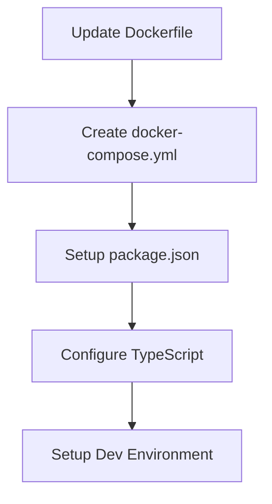
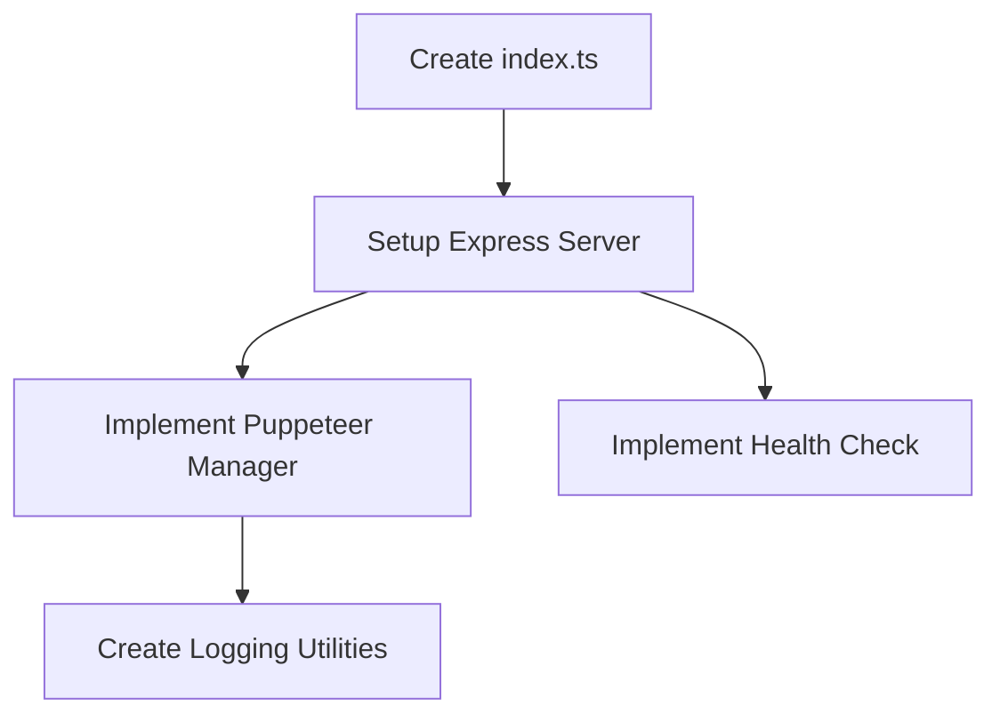
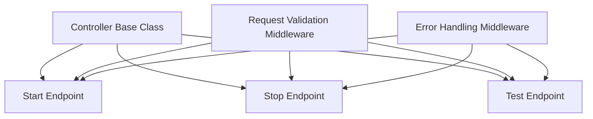
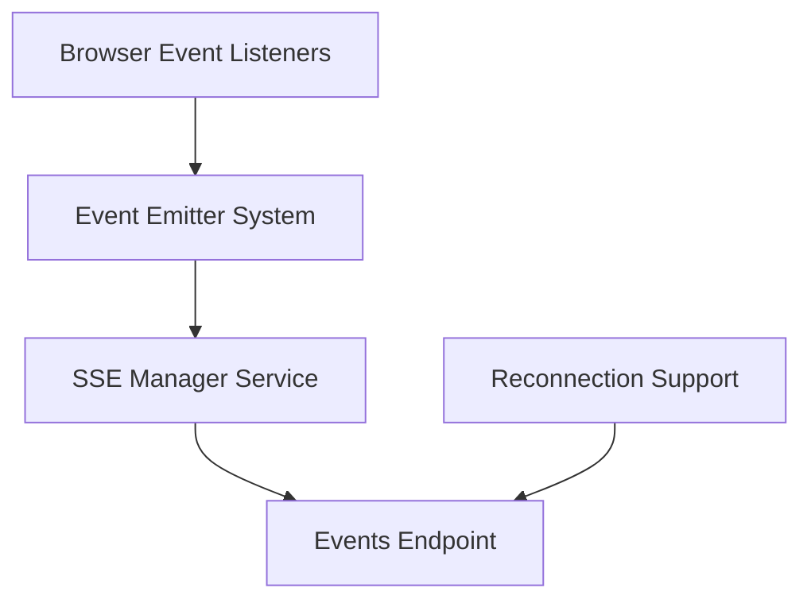
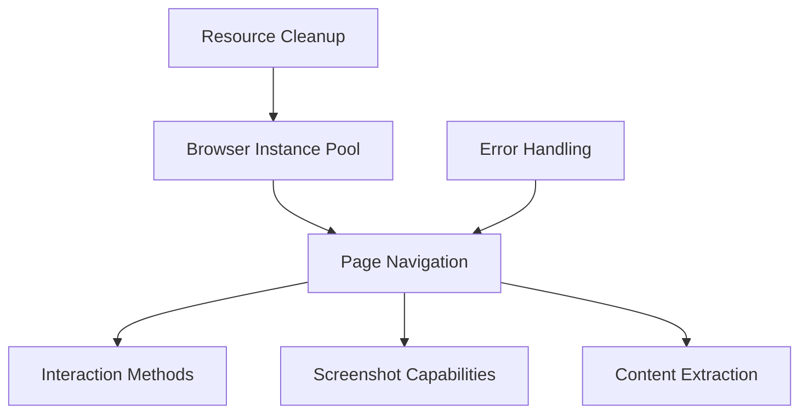
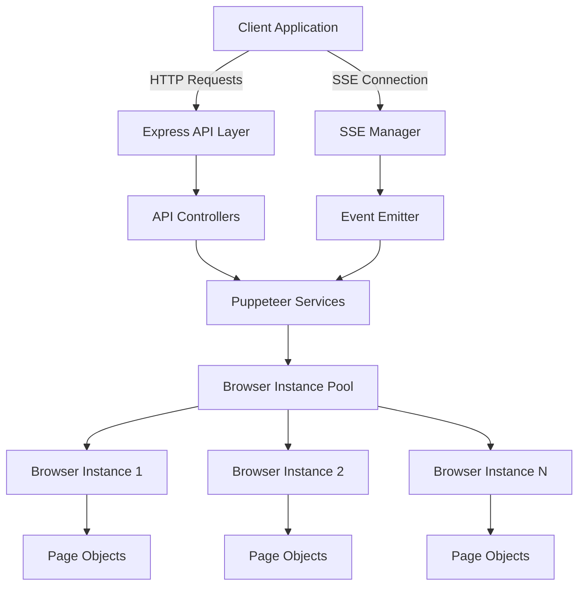
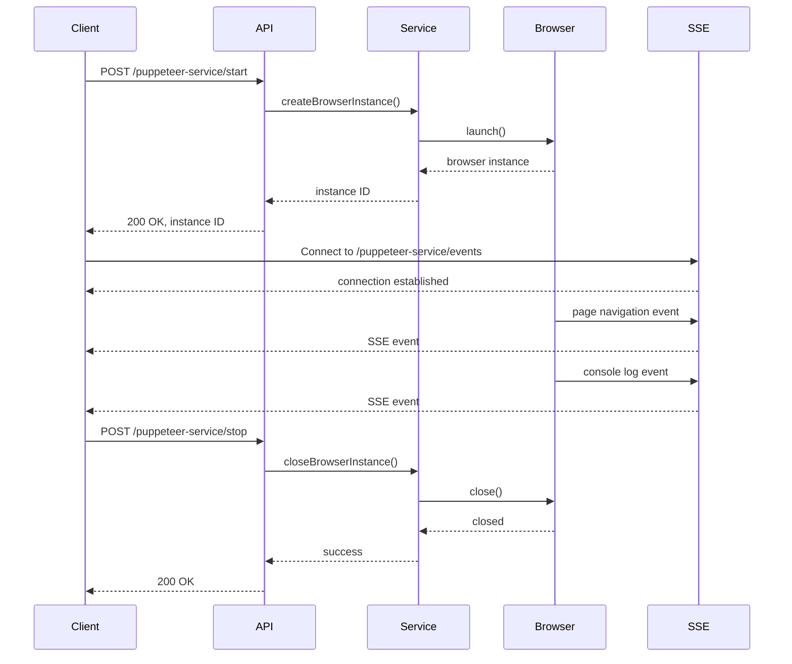

# Puppeteer Service Implementation Plan

## Overview

This document outlines a comprehensive plan for implementing a containerized Puppeteer service with RESTful API endpoints and Server-Sent Events (SSE) capabilities. Our approach prioritizes building a working solution first, followed by optimization.

## Implementation Phases

### Phase 1: Environment and Infrastructure Setup (1-2 days)

#### Tasks:

1. **Review and Update Dockerfile**
   - Verify all required dependencies are included
   - Ensure proper user permissions and security settings
   - Configure shared memory settings for Chromium

2. **Create docker-compose.yml**
   - Define service configuration
   - Set appropriate resource limits (memory, CPU)
   - Configure networking and port mapping
   - Set up shared memory volume if needed

3. **Setup package.json**
   - Define required dependencies (Express, Puppeteer, etc.)
   - Configure scripts for development and production
   - Set up TypeScript and linting configuration

4. **Configure TypeScript**
   - Create tsconfig.json with appropriate settings
   - Set up path aliases for cleaner imports
   - Configure strict type checking

5. **Setup Development Environment**
   - Configure nodemon for hot reloading
   - Set up debugging configuration
   - Create npm scripts for common tasks

#### Deliverables:
- Functional Docker environment
- Project configuration files
- Development workflow setup

### Phase 2: Application Core Implementation (2-3 days)

#### Tasks:

1. **Create Application Entry Point**
   - Set up src/index.ts as the main entry point
   - Configure Express application
   - Implement graceful shutdown handling

2. **Implement Core Express Server**
   - Set up middleware configuration
   - Configure error handling
   - Implement request logging

3. **Create Puppeteer Service Manager**
   - Implement browser instance launch with appropriate flags
   - Create basic page management functionality
   - Implement proper error handling and recovery

4. **Develop Logging and Utilities**
   - Create structured logging service
   - Implement helper utilities for common operations
   - Set up environment configuration management

5. **Implement Health Check System**
   - Create /health endpoint
   - Implement Puppeteer-specific health checks
   - Configure Docker health check integration

#### Deliverables:
- Working Express application
- Basic Puppeteer functionality
- Health check system
- Logging infrastructure

### Phase 3: RESTful API Implementation (3-4 days)

#### Tasks:

1. **Implement API Controller Structure**
   - Create controller base class or interface
   - Implement routing configuration
   - Set up request validation framework

2. **Develop Start Endpoint**
   - Implement /puppeteer-service/start endpoint
   - Create request validation
   - Handle browser instance creation and management

3. **Develop Stop Endpoint**
   - Implement /puppeteer-service/stop endpoint
   - Handle graceful browser instance termination
   - Implement resource cleanup

4. **Create Test Endpoint**
   - Implement /puppeteer-service/test endpoint
   - Create simple page navigation and screenshot functionality
   - Return appropriate responses (status, content, etc.)

5. **Implement Middleware**
   - Create request validation middleware
   - Implement error handling middleware
   - Set up response formatting middleware

#### Deliverables:
- Functional RESTful API endpoints
- Request validation system
- Error handling framework
- Basic Puppeteer operations through API

### Phase 4: Server-Sent Events Implementation (2-3 days)

#### Tasks:

1. **Create SSE Manager Service**
   - Implement connection handling
   - Create client tracking system
   - Set up event broadcasting mechanism

2. **Develop Events Endpoint**
   - Implement /puppeteer-service/events endpoint
   - Configure proper headers and content types
   - Set up connection maintenance

3. **Implement Event Emitter System**
   - Create centralized event bus
   - Implement event types and structures
   - Set up event filtering and routing

4. **Develop Browser Event Listeners**
   - Capture page navigation events
   - Monitor console output
   - Track resource loading
   - Capture network activity

5. **Implement Reconnection Support**
   - Add event IDs for tracking
   - Implement last-event-id header handling
   - Create client reconnection logic

#### Deliverables:
- Functional SSE endpoint
- Real-time browser event streaming
- Reconnection support
- Event tracking system

### Phase 5: Puppeteer Service Implementation (4-5 days)

#### Tasks:

1. **Implement Browser Instance Pool**
   - Create browser instance management system
   - Implement instance creation and tracking
   - Set up resource limits and monitoring

2. **Develop Page Navigation System**
   - Implement URL navigation with configurable options
   - Create waitFor functionality (selectors, network, etc.)
   - Implement timeouts and error handling

3. **Create Interaction Methods**
   - Implement click operations
   - Create form filling functionality
   - Develop keyboard input simulation
   - Add scroll and hover capabilities

4. **Implement Screenshot and PDF Features**
   - Create full-page screenshot capability
   - Implement element-specific screenshots
   - Add PDF generation functionality

5. **Develop Content Extraction**
   - Implement HTML content extraction
   - Create text content retrieval
   - Add element-specific content extraction
   - Implement metadata collection

6. **Implement Error Handling and Recovery**
   - Create error classification system
   - Implement recovery strategies
   - Develop retry mechanisms

7. **Add Resource Cleanup**
   - Implement proper page closure
   - Ensure browser instance termination
   - Add memory management strategies

#### Deliverables:
- Complete Puppeteer service implementation
- Browser instance pool management
- Comprehensive page interaction capabilities
- Error handling and recovery system
- Resource management framework

### Phase 6: Security and Performance (2-3 days)

#### Tasks:

1. **Implement Input Validation**
   - Create comprehensive validation schemas
   - Implement sanitation for user inputs
   - Add URL validation and filtering

2. **Set Up Request Limiting**
   - Implement rate limiting middleware
   - Create concurrency controls
   - Set up queue management for requests

3. **Configure Timeouts and Circuit Breakers**
   - Implement request timeouts
   - Create circuit breaker pattern for failing operations
   - Add graceful degradation strategies

4. **Implement Resource Monitoring**
   - Create memory usage monitoring
   - Implement CPU usage tracking
   - Set up alerting for resource constraints

5. **Configure Security Headers and CORS**
   - Implement security headers middleware
   - Set up CORS configuration
   - Create content security policy

#### Deliverables:
- Input validation and sanitation system
- Rate limiting and request throttling
- Timeout and circuit breaker implementation
- Resource monitoring framework
- Security configuration

### Phase 7: Testing and Validation (3-4 days)

#### Tasks:

1. **Implement Unit Tests**
   - Create tests for core services
   - Implement controller unit tests
   - Add utility function tests

2. **Develop Integration Tests**
   - Create API endpoint tests
   - Implement end-to-end workflow tests
   - Add error handling tests

3. **Set Up Docker Testing**
   - Create container startup tests
   - Implement health check validation
   - Add resource usage tests

4. **Implement Performance Tests**
   - Create load testing scripts
   - Implement concurrency tests
   - Add memory leak detection

5. **Create Documentation**
   - Develop API documentation
   - Create usage examples
   - Add troubleshooting guide

#### Deliverables:
- Comprehensive test suite
- Container validation tests
- Performance test framework
- API documentation

## System Architecture

## Request Flow Diagram

## Implementation Considerations

### Critical Success Factors

1. **Stable Chromium Execution in Docker**
   - Configure appropriate memory and resource settings
   - Implement proper error handling and recovery
   - Use recommended launch flags for containerized environments

2. **Reliable SSE Implementation**
   - Ensure proper HTTP headers and content types
   - Implement connection keep-alive mechanisms
   - Handle reconnection gracefully

3. **Efficient Resource Management**
   - Properly close browser instances and pages
   - Implement timeout mechanisms for inactive sessions
   - Monitor and control memory usage

4. **Comprehensive Error Handling**
   - Classify and respond to different error types
   - Implement retry mechanisms where appropriate
   - Provide clear error messages and status codes

### Potential Challenges

1. **Memory Management in Docker**
   - Challenge: Chromium can consume significant memory
   - Mitigation: Configure appropriate container limits, implement resource monitoring

2. **Browser Stability**
   - Challenge: Headless browsers can crash under certain conditions
   - Mitigation: Implement proper error handling, process monitoring, and recovery strategies

3. **Request Overload**
   - Challenge: Too many concurrent requests can overwhelm the service
   - Mitigation: Implement rate limiting, queuing, and concurrency controls

4. **Long-Running Connections**
   - Challenge: SSE connections can remain open for extended periods
   - Mitigation: Implement proper connection management and timeout mechanisms

## Next Steps

1. Start with setting up the development environment and Docker configuration
2. Implement a minimal viable product (MVP) with basic Puppeteer functionality
3. Validate the core functionality in the Docker container before proceeding to more advanced features
4. Focus on stability and error handling before performance optimization