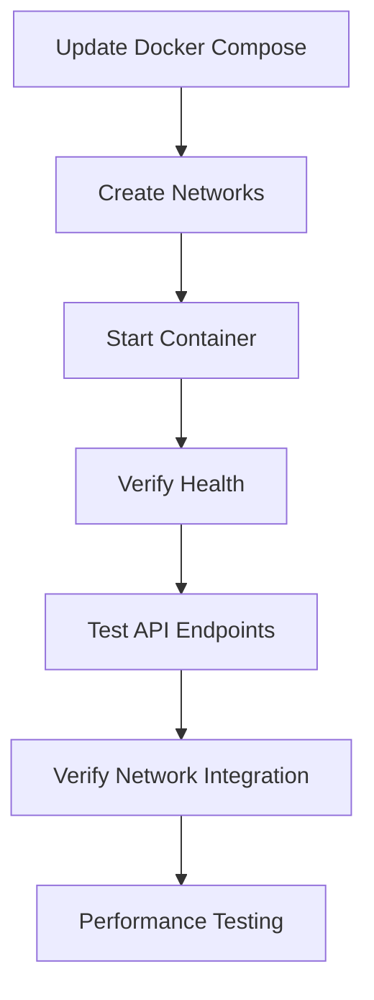

# Puppeteer Service Implementation and Testing Steps

## Overview

This document outlines the step-by-step process to implement our Docker network integration and test the Puppeteer service in the integrated environment. The goal is to ensure our service works correctly both as a standalone container and within the broader LibreChat ecosystem.

## Implementation Process



## Step 1: Network Configuration

### 1.1 Check Existing Networks

First, verify the LibreChat network name:

```bash
docker network ls | grep librechat
```

Expected output will show the LibreChat network, likely named `librechat_default`.

### 1.2 Create MCP Services Network

Create our dedicated network for microservices:

```bash
docker network create mcp-services
```

### 1.3 Update Docker Compose File

Switch to Code mode to update the docker-compose.yml file according to the specifications in `dockerComposeUpdates.md`.

## Step 2: Service Deployment

### 2.1 Build the Updated Container

```bash
docker-compose build
```

### 2.2 Start the Container

```bash
docker-compose up -d
```

### 2.3 Verify Container Status

```bash
docker ps | grep puppeteer-service
```

Expected output should show the container running with status "Up".

## Step 3: Health Verification

### 3.1 Check Container Logs

```bash
docker logs puppeteer-service
```

Look for:
- Server startup message
- Puppeteer initialization success
- No critical errors

### 3.2 Test Health Endpoint

```bash
curl http://localhost:3000/health
```

Expected response:
```json
{
  "status": "UP",
  "timestamp": "2025-03-15T14:XX:XX.XXXZ",
  "puppeteer": "READY"
}
```

## Step 4: API Functionality Testing

### 4.1 Create Browser Instance

```bash
curl -X POST http://localhost:3000/puppeteer-service/start \
    -H "Content-Type: application/json"
```

Expected response should include a browser instance ID:
```json
{
  "success": true,
  "browserId": "some-uuid-here"
}
```

### 4.2 Test Navigation to LibreChat

```bash
curl -X POST http://localhost:3000/puppeteer-service/test \
    -H "Content-Type: application/json" \
    -d '{"browserId": "<BROWSER_ID>", "url": "http://LibreChat:3080"}'
```

Expected response should include success status and screenshot data.

### 4.3 Test Navigation to External Site

```bash
curl -X POST http://localhost:3000/puppeteer-service/test \
    -H "Content-Type: application/json" \
    -d '{"browserId": "<BROWSER_ID>", "url": "https://example.com"}'
```

Expected response should include success status and screenshot data.

### 4.4 Close Browser Instance

```bash
curl -X POST http://localhost:3000/puppeteer-service/stop \
    -H "Content-Type: application/json" \
    -d '{"browserId": "<BROWSER_ID>"}'
```

Expected response:
```json
{
  "success": true
}
```

## Step 5: Network Integration Verification

### 5.1 Verify Network Connections

```bash
docker network inspect librechat_default
```

Look for the Puppeteer service container in the output.

```bash
docker network inspect mcp-services
```

Look for the Puppeteer service container in the output.

### 5.2 Test Network Communication

Test if the Puppeteer service can communicate with the LibreChat container:

```bash
docker exec puppeteer-service curl -s http://LibreChat:3080/api/health
```

Expected output should be a successful response from the LibreChat API.

## Step 6: Performance Testing

### 6.1 Monitor Resource Usage

```bash
docker stats puppeteer-service
```

Review CPU, memory, and network usage.

### 6.2 Create Multiple Browser Instances

Create several browser instances to test concurrent performance:

```bash
# Run this script multiple times
for i in {1..5}; do
  curl -X POST http://localhost:3000/puppeteer-service/start \
      -H "Content-Type: application/json"
done
```

### 6.3 Check Container Stability

After running performance tests, check container logs and health:

```bash
docker logs puppeteer-service
curl http://localhost:3000/health
```

## Step 7: Record Test Results

Document the test results in a new file `testResults.md`, including:

1. Commands executed and responses received
2. Any issues or errors encountered
3. Performance observations
4. Screenshots or other output (if applicable)

## Success Criteria

The implementation is considered successful if:

1. The Puppeteer service container starts and remains stable
2. The health endpoint returns status 200 with "READY" for Puppeteer
3. Browser instances can be created, pages can be navigated, and screenshots can be taken
4. The service can communicate with the LibreChat container
5. Resource usage remains within acceptable limits

## Next Steps After Implementation

1. Based on test results, make any necessary adjustments to:
   - Docker Compose configuration
   - Network settings
   - Resource limits
   - Puppeteer service code

2. Document any changes made and their impact

3. Once stable, integrate with additional services in the LibreChat ecosystem

4. Consider adding authentication or additional security measures