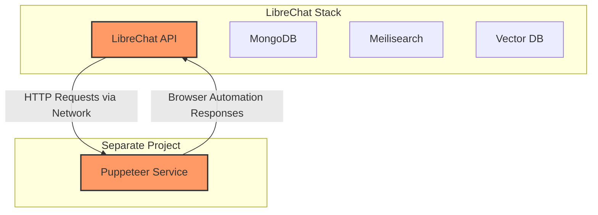

# LibreChat and Puppeteer Service Integration Plan

## Will LibreChat Have Access to Puppeteer Tools?

**Yes, LibreChat will have access to Puppeteer tools** when the integration is set up correctly. This document outlines the technical details of how the integration works, implementation steps, and verification methods.

## Technical Integration Architecture



## How LibreChat Integrates with External Services

LibreChat uses environment variables to configure connections to external services. For the Puppeteer service:

1. Environment variables in docker-compose.override.yml:
   - `PUPPETEER_SERVICE_URL`: Points to the Puppeteer service URL
   - `ENABLE_PUPPETEER_SERVICE`: Enables the Puppeteer functionality

2. Network connection:
   - Both services must be on the same Docker network
   - The hostname `puppeteer-service` must be resolvable on this network

## Implementation Steps

### 1. Start the Puppeteer Service First

```bash
# From ~/Puppeteer directory
./run-with-network.sh librechat_default
```

This script:
- Connects to the LibreChat network
- Creates the mcp-services network if needed
- Starts the Puppeteer service on port 3000
- Verifies connectivity

### 2. Update LibreChat Configuration

Update your ~/LibreChat/docker-compose.override.yml:

```yaml
services:
  api:
    volumes:
      - type: bind
        source: ./librechat.yaml
        target: /app/librechat.yaml
      - type: bind
        source: /Users/black/obsidian_vault/mystique
        target: /obsidian-vault
      - type: bind
        source: ./files
        target: /app/files
      - type: bind
        source: /Users/black/LibreChat/mcp-servers
        target: /app/mcp-servers
    environment:
      #  - BRAVE_API_KEY=${BRAVE_API_KEY}
      #  - NODE_ENV=production
      # Puppeteer service integration
      - PUPPETEER_SERVICE_URL=http://puppeteer-service:3000
      - ENABLE_PUPPETEER_SERVICE=true
  
  metrics:
    image: ghcr.io/virtuos/librechat_exporter:main
    depends_on:
      - mongodb
    ports:
      - "8000:8000"
    restart: unless-stopped
```

### 3. Start or Restart LibreChat

```bash
# From ~/LibreChat directory
docker-compose down
docker-compose up -d
```

## Verification Steps

### 1. Verify Network Connectivity

Check if the containers are on the same network:

```bash
docker network inspect librechat_default | grep -A 5 "Containers"
```

### 2. Verify Service Discovery

Test if LibreChat can resolve and reach the Puppeteer service:

```bash
docker exec -it librechat-api curl -s http://puppeteer-service:3000/health
```

Expected output:
```json
{
  "status": "UP",
  "timestamp": "2025-03-15T17:45:00.000Z",
  "puppeteer": "READY"
}
```

### 3. Verify Functional Integration

Test the LibreChat UI with browser automation features. If Puppeteer is correctly integrated, you should see options in the LibreChat interface that use browser automation, such as:

- Web browsing capabilities
- Screenshot capture
- Content extraction from websites

## Benefits of Keeping Projects Separate

1. **Clean Organization**: Each service maintains its own codebase and dependencies
2. **Independent Updates**: Update either service without affecting the other
3. **Resource Management**: Control resource allocation independently
4. **Security Isolation**: Stronger security boundaries between services

## Potential Issues and Solutions

| Issue | Cause | Solution |
|-------|-------|----------|
| LibreChat cannot connect to Puppeteer | Network not shared | Ensure both services are on the same Docker network |
| Service discovery fails | DNS resolution | Verify container names and network settings |
| Features not appearing in UI | Environment variables not set | Check ENABLE_PUPPETEER_SERVICE is set to true |
| Browser actions fail | Resource limitations | Check Puppeteer service logs and increase resource limits if needed |

## Best Practice: Starting Order

Always start the Puppeteer service **before** LibreChat to ensure it's available when LibreChat initializes. This prevents connection errors during startup.

## Conclusion

With the proper configuration and networking setup, LibreChat will successfully detect and utilize the Puppeteer service's capabilities, making browser automation tools available to the user interface.