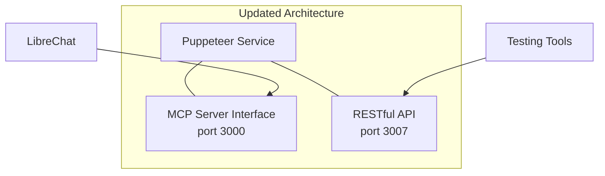

# MCP Implementation Plan for Puppeteer Service

## Overview

We'll adapt the existing Puppeteer service to implement the Model Context Protocol (MCP) directly while maintaining the current RESTful API endpoints for testing purposes.



## Project Structure Updates

```
~/Puppeteer/
├── src/
│   ├── index.ts                    # Main entry point (will be updated)
│   ├── controllers/                # RESTful API controllers (unchanged)
│   │   ├── index.ts
│   │   ├── puppeteer.controller.ts
│   │   └── sse.controller.ts
│   ├── services/                   # Core services (unchanged)
│   │   ├── puppeteer.service.ts
│   │   └── sse.service.ts
│   ├── mcp/                        # New MCP implementation
│   │   ├── index.ts                # MCP server entry point
│   │   ├── server.ts               # MCP server definition
│   │   ├── tools/                  # MCP tool implementations
│   │   │   ├── index.ts
│   │   │   ├── browser.tools.ts    # Browser creation/management tools
│   │   │   ├── navigation.tools.ts # Page navigation tools
│   │   │   └── screenshot.tools.ts # Screenshot tools
│   │   └── resources/              # MCP resource implementations
│   │       ├── index.ts
│   │       └── browser.resources.ts
│   └── utils/                      # Existing utilities
│       ├── logger.ts
│       └── healthcheck.ts
```

## Implementation Steps

### 1. Add MCP Dependencies

Update package.json to include MCP SDK:

```json
{
  "dependencies": {
    "@modelcontextprotocol/sdk": "^latest",
    // ... existing dependencies
  }
}
```

Install the dependencies:

```bash
npm install
```

### 2. Create MCP Server Implementation

Create the MCP server entry point at `src/mcp/index.ts`:

```typescript
import { Server } from '@modelcontextprotocol/sdk/server/index.js';
import { StdioServerTransport } from '@modelcontextprotocol/sdk/server/stdio.js';
import { setupTools } from './tools';
import { setupResources } from './resources';
import { logger } from '../utils/logger';

export async function startMcpServer() {
  // Create MCP server
  const server = new Server(
    {
      name: 'puppeteer-service',
      version: '1.0.0',
    },
    {
      capabilities: {
        tools: {},
        resources: {},
      },
    }
  );

  // Set up tools and resources
  setupTools(server);
  setupResources(server);

  // Set up error handling
  server.onerror = (error) => {
    logger.error('[MCP Error]', error);
  };

  // Connect using stdio transport
  const transport = new StdioServerTransport();
  await server.connect(transport);
  
  logger.info('MCP server is running');

  // Handle cleanup
  process.on('SIGINT', async () => {
    logger.info('SIGINT received: closing MCP server');
    await server.close();
    process.exit(0);
  });

  process.on('SIGTERM', async () => {
    logger.info('SIGTERM received: closing MCP server');
    await server.close();
    process.exit(0);
  });

  return server;
}
```

### 3. Convert Existing Functionality to MCP Tools

Create tool implementations that wrap your existing Puppeteer service:

#### Browser Tools (`src/mcp/tools/browser.tools.ts`):

```typescript
import { Server } from '@modelcontextprotocol/sdk/server/index.js';
import { 
  CallToolRequestSchema, 
  ErrorCode, 
  McpError 
} from '@modelcontextprotocol/sdk/types.js';
import { PuppeteerService } from '../../services/puppeteer.service';

export function setupBrowserTools(server: Server) {
  const puppeteerService = PuppeteerService.getInstance();

  // Define tools for browser management
  server.setRequestHandler(ListToolsRequestSchema, async () => ({
    tools: [
      {
        name: 'create_browser',
        description: 'Create a new browser instance',
        inputSchema: {
          type: 'object',
          properties: {},
          required: [],
        },
      },
      {
        name: 'close_browser',
        description: 'Close a browser instance',
        inputSchema: {
          type: 'object',
          properties: {
            browserId: {
              type: 'string',
              description: 'ID of the browser instance to close',
            },
          },
          required: ['browserId'],
        },
      },
      // Additional tool definitions
    ],
  }));

  // Implement tool handlers
  server.setRequestHandler(CallToolRequestSchema, async (request) => {
    switch (request.params.name) {
      case 'create_browser': {
        try {
          const browserId = await puppeteerService.createBrowserInstance();
          
          if (!browserId) {
            return {
              content: [
                {
                  type: 'text',
                  text: 'Failed to create browser instance',
                },
              ],
              isError: true,
            };
          }

          return {
            content: [
              {
                type: 'text',
                text: JSON.stringify({ browserId }),
              },
            ],
          };
        } catch (error) {
          return {
            content: [
              {
                type: 'text',
                text: `Error: ${error.message}`,
              },
            ],
            isError: true,
          };
        }
      }

      case 'close_browser': {
        try {
          const { browserId } = request.params.arguments;
          
          if (!browserId) {
            throw new McpError(
              ErrorCode.InvalidParams,
              'Browser ID is required'
            );
          }

          const success = await puppeteerService.closeBrowserInstance(browserId);
          
          if (!success) {
            return {
              content: [
                {
                  type: 'text',
                  text: `Browser instance not found: ${browserId}`,
                },
              ],
              isError: true,
            };
          }

          return {
            content: [
              {
                type: 'text',
                text: JSON.stringify({ success: true }),
              },
            ],
          };
        } catch (error) {
          return {
            content: [
              {
                type: 'text',
                text: `Error: ${error.message}`,
              },
            ],
            isError: true,
          };
        }
      }

      // Additional tool implementations

      default:
        throw new McpError(
          ErrorCode.MethodNotFound,
          `Unknown tool: ${request.params.name}`
        );
    }
  });
}
```

### 4. Update Main Entry Point to Support Both Interfaces

Update `src/index.ts` to start both the RESTful API and MCP server:

```typescript
import express, { Express } from 'express';
import cors from 'cors';
import helmet from 'helmet';
import morgan from 'morgan';
import { setupRoutes } from './controllers';
import { logger } from './utils/logger';
import { PuppeteerService } from './services/puppeteer.service';
import { startMcpServer } from './mcp';

// Initialize Puppeteer service (shared between REST API and MCP)
const puppeteerService = PuppeteerService.getInstance();

// Start MCP server if running in MCP mode
if (process.env.MCP_MODE === 'true') {
  logger.info('Starting in MCP mode');
  startMcpServer().catch((err) => {
    logger.error('Failed to start MCP server', err);
    process.exit(1);
  });
} else {
  // Start REST API server
  const app: Express = express();
  const restPort = process.env.REST_PORT || 3007; // Change RESTful API port to 3007

  // Middleware
  app.use(cors());
  app.use(helmet());
  app.use(express.json());
  app.use(morgan('dev'));

  // Health check endpoint
  app.get('/health', (req, res) => {
    res.status(200).json({
      status: 'UP',
      timestamp: new Date().toISOString(),
      puppeteer: puppeteerService.isInitialized() ? 'READY' : 'INITIALIZING'
    });
  });

  // Setup API routes
  setupRoutes(app);

  // Start the server
  const server = app.listen(restPort, () => {
    logger.info(`RESTful API server is running on port ${restPort}`);
  });

  // Graceful shutdown
  process.on('SIGTERM', () => {
    logger.info('SIGTERM signal received: closing HTTP server');
    server.close(() => {
      logger.info('HTTP server closed');
      puppeteerService.shutdown()
        .then(() => {
          logger.info('Puppeteer service shut down successfully');
          process.exit(0);
        })
        .catch((err) => {
          logger.error('Error shutting down Puppeteer service', { error: err });
          process.exit(1);
        });
    });
  });

  process.on('SIGINT', () => {
    logger.info('SIGINT signal received: closing HTTP server');
    server.close(() => {
      logger.info('HTTP server closed');
      puppeteerService.shutdown()
        .then(() => {
          logger.info('Puppeteer service shut down successfully');
          process.exit(0);
        })
        .catch((err) => {
          logger.error('Error shutting down Puppeteer service', { error: err });
          process.exit(1);
        });
    });
  });
}
```

### 5. Update Docker Configuration

Update Dockerfile to support both modes:

```dockerfile
# ... existing Dockerfile content

# Install MCP SDK
RUN npm install --save @modelcontextprotocol/sdk

# ... other build steps

# For MCP mode, expose port 3000
# For REST API mode, expose port 3007
EXPOSE 3000 3007

# Default to REST API mode
ENV MCP_MODE=false
ENV REST_PORT=3007

# Start in REST API mode by default
CMD ["node", "dist/index.js"]
```

Update docker-compose.yml to expose both ports:

```yaml
services:
  puppeteer-service:
    # ... existing config
    ports:
      - "3000:3000"  # MCP port
      - "3007:3007"  # REST API port
    environment:
      - NODE_ENV=development
      - LOG_LEVEL=debug
      - MCP_MODE=false  # Set to 'true' to start in MCP mode
      - REST_PORT=3007
```

### 6. Create Separate Start Scripts

Create a script to run in MCP mode (`start-mcp.sh`):

```bash
#!/bin/bash

# Start the Puppeteer service in MCP mode
docker run -it --rm \
  --name puppeteer-mcp \
  --network librechat_default \
  -e MCP_MODE=true \
  puppeteer-service:latest
```

Update the existing run script for RESTful API mode:

```bash
#!/bin/bash

# Default network if not specified
NETWORK=${1:-librechat_default}

# ... existing script content

# Run with the specified network in RESTful API mode
echo "Starting puppeteer-service with network: $NETWORK"
LIBRECHAT_NETWORK=$NETWORK MCP_MODE=false REST_PORT=3007 docker-compose up -d
```

### 7. Update LibreChat Configuration

Update LibreChat's librechat.yaml to include your MCP-enabled Puppeteer service:

```yaml
mcpServers:
  puppeteer-service:
    type: stdio
    command: docker
    args:
      - exec
      - -i
      - puppeteer-service
      - node
      - /app/dist/index.js
    env:
      - MCP_MODE=true
    timeout: 300000
```

## Testing Plan

1. **Test RESTful API Endpoints**:
   ```bash
   # Start in RESTful API mode
   ./run-with-network.sh librechat_default
   
   # Test endpoints
   curl -X POST http://localhost:3007/puppeteer-service/start -H "Content-Type: application/json"
   ```

2. **Test MCP Integration**:
   ```bash
   # Start in MCP mode
   ./start-mcp.sh
   
   # Configure LibreChat to use the MCP server
   # Test via LibreChat UI
   ```

## Next Steps

1. Implement the MCP server and tools
2. Test both interfaces independently
3. Update LibreChat configuration
4. Test full integration with LibreChat

This plan provides a path forward for implementing MCP support in your Puppeteer service while maintaining the existing RESTful API for testing purposes.