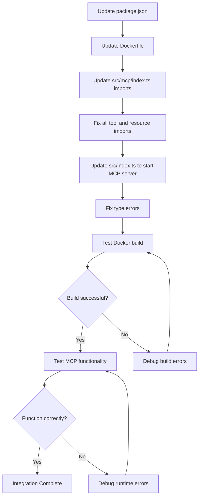

# MCP SDK Integration Flow

## Critical Path Items

1. **Update Dependencies**
   - Add `@modelcontextprotocol/sdk@1.7.0` to package.json
   - Update Dockerfile to install SDK if not in package.json

2. **Fix Import Statements**
   - Replace mock imports in all MCP-related files
   - Use correct module paths for server and types

3. **Update Application Logic**
   - Update index.ts to properly initialize the MCP server
   - Ensure proper error handling and shutdown procedures

4. **Fix Type Issues**
   - Add explicit type annotations where needed
   - Handle unknown error types appropriately

5. **Testing**
   - Verify Docker build completes
   - Test MCP mode functionality
   - Ensure all MCP methods work as expected