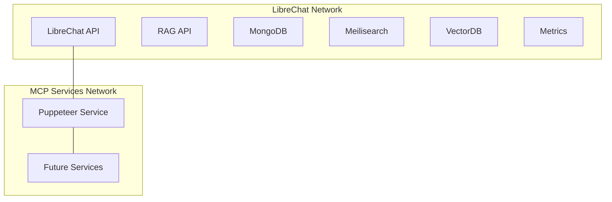

# Puppeteer Service Network Integration Plan

## Current LibreChat Docker Environment

The LibreChat project currently runs in a Docker Compose setup with the following services:

- **LibreChat API** (main application): Accessible at port 3080
- **RAG API**: ML-related functionality
- **MongoDB**: Database service
- **Meilisearch**: Search service
- **Vector DB**: pgvector for embeddings
- **Metrics**: Monitoring service

## Network Integration Strategy



### Integration Approach

1. **Create Dedicated Network**:
   - Establish a new "mcp-services" network for our Puppeteer service and future microservices
   - This provides better isolation and organization

2. **Connect to LibreChat Network**:
   - Allow the Puppeteer service to also connect to the LibreChat network
   - This enables direct communication with the LibreChat application

3. **Port Exposure**:
   - Expose the Puppeteer service port (3000) to the host
   - This allows external access for testing and integration

## Docker Compose Configuration Updates

We'll need to update our docker-compose.yml to include network configuration:

```yaml
version: '3.8'

networks:
  librechat-network:
    external: true
  mcp-services:
    driver: bridge

services:
  puppeteer-service:
    build:
      context: .
      dockerfile: Dockerfile
    container_name: puppeteer-service
    ports:
      - "3000:3000"
    volumes:
      - ./src:/app/src
      - ./dist:/app/dist
      - ./node_modules:/app/node_modules
    environment:
      - NODE_ENV=development
      - LOG_LEVEL=debug
    restart: unless-stopped
    shm_size: 1gb
    deploy:
      resources:
        limits:
          cpus: '1'
          memory: 2G
    healthcheck:
      test: ["CMD", "curl", "-f", "http://localhost:3000/health"]
      interval: 30s
      timeout: 10s
      retries: 3
      start_period: 30s
    networks:
      - librechat-network
      - mcp-services
```

## Integration Testing Plan

### 1. Standalone Testing
First, ensure the Puppeteer service works correctly on its own:
- Start with `docker-compose up`
- Test basic functionality (browser creation, navigation, screenshots)

### 2. Network Communication Testing
Test communication between networks:
- Verify the Puppeteer service can reach the LibreChat API
- Test using a simple API call or ping

### 3. Integration Testing
Test practical integration scenarios:
- Use Puppeteer to automate interactions with the LibreChat web interface
- Test capturing screenshots of LibreChat UI for monitoring
- Verify the Puppeteer service can be discovered by other services

### 4. Performance Testing
Evaluate performance in the integrated environment:
- Monitor resource usage when running alongside LibreChat
- Test concurrency and parallel browser instances
- Measure response times for API calls

## Deployment Process

1. **Pre-Integration**:
   - Ensure LibreChat is running
   - Identify the network name (likely "librechat_default" if using the default Docker Compose network)

2. **Integration Steps**:
   ```bash
   # Create the mcp-services network if it doesn't exist
   docker network create mcp-services
   
   # Start the Puppeteer service with the updated docker-compose.yml
   docker-compose up -d
   
   # Verify network connections
   docker network inspect librechat_default
   docker network inspect mcp-services
   ```

3. **Post-Integration Verification**:
   - Check container connectivity
   - Verify API endpoints are accessible
   - Test browser automation functionality

## Security Considerations

1. **Network Isolation**:
   - Limit network access to only required services
   - Use network policies if available

2. **Resource Protection**:
   - Set appropriate resource limits to prevent DoS scenarios
   - Implement rate limiting for API endpoints

3. **Access Control**:
   - Consider adding authentication to the Puppeteer service API
   - Restrict who can create browser instances

## Future Expandability

The "mcp-services" network provides a foundation for adding more microservices:

1. **Service Discovery**:
   - Consider implementing service discovery for automatic integration
   - Document service endpoints and capabilities

2. **Load Balancing**:
   - Plan for scaling with multiple Puppeteer service instances
   - Consider adding a load balancer for distributing requests

3. **Monitoring**:
   - Integrate with the existing metrics service
   - Add Puppeteer-specific metrics for monitoring