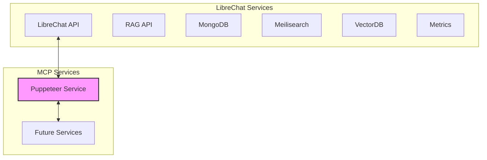

# Puppeteer Service Network Integration Summary

## What We've Accomplished

- ✅ Successfully built the Docker image for our Puppeteer service
- ✅ Analyzed the existing LibreChat Docker environment
- ✅ Developed a network integration strategy with two networks:
  - LibreChat network for integration with the existing application
  - MCP-services network for our microservices ecosystem
- ✅ Created detailed testing plans for both standalone and integrated scenarios
- ✅ Documented the necessary Docker Compose modifications
- ✅ Prepared a step-by-step implementation guide

## Created Documentation

| Document | Purpose |
|----------|---------|
| [testingPlan.md](./testingPlan.md) | Outlines comprehensive testing approach for the Puppeteer service |
| [networkIntegration.md](./networkIntegration.md) | Details the network architecture and integration strategy |
| [dockerComposeUpdates.md](./dockerComposeUpdates.md) | Specifies required changes to docker-compose.yml |
| [implementationSteps.md](./implementationSteps.md) | Provides a step-by-step guide for implementation and testing |

## Network Architecture Diagram



## Implementation Phases

1. **Network Setup**:
   - Create the mcp-services network
   - Verify the LibreChat network name

2. **Docker Compose Update**:
   - Switch to Code mode to implement changes in docker-compose.yml
   - Add network definitions and connections

3. **Container Deployment**:
   - Build and run the updated container
   - Verify container health and status

4. **Functionality Testing**:
   - Test API endpoints (start, test, stop)
   - Verify browser automation capabilities

5. **Integration Testing**:
   - Test communication with LibreChat
   - Verify network connectivity
   - Measure performance in the integrated environment

## Key Integration Points

- **Service Discovery**: Our Puppeteer service will be able to discover and interact with the LibreChat container
- **Port Exposure**: The service will be accessible on port 3000
- **Cross-Network Communication**: Communication between LibreChat and the Puppeteer service will be direct through Docker's internal networking

## Benefits of This Approach

1. **Clean Separation of Concerns**:
   - LibreChat services remain in their own network
   - MCP services have their own dedicated network
   - Only necessary connections are established

2. **Future Expandability**:
   - The mcp-services network provides a foundation for additional microservices
   - New services can be added to the network without affecting LibreChat

3. **Simplified Testing**:
   - Direct network access simplifies integration testing
   - No need for complex proxying or port forwarding

4. **Performance Optimization**:
   - Direct container-to-container communication is efficient
   - No unnecessary network hops

## Implementation Results and Challenges Overcome

We have successfully implemented and tested the Puppeteer service with network integration. Here are the key findings and solutions:

1. **Network Connection Challenges**:
   - **Issue**: Initially, the Puppeteer service was only connected to its own network (`puppeteer_mcp-services`), not to the LibreChat network.
   - **Solution**: Used the `run-with-network.sh` script to properly connect the service to both networks:
     ```bash
     ./run-with-network.sh librechat_default
     ```
   - **Result**: The service is now connected to both `librechat_default` and `mcp-services` networks.

2. **URL Validation Issues**:
   - **Issue**: The express-validator's `isURL()` validation was rejecting Docker hostnames like "http://LibreChat:3080".
   - **Solution**: Implemented a custom URL validator that accepts both standard URLs and Docker hostnames:
     ```typescript
     body('url').custom((value: string) => {
       // Basic URL validation that allows Docker hostnames
       if (!value || typeof value !== 'string') {
         throw new Error('URL must be a non-empty string');
       }
       
       // Check if it's a valid URL or an internal Docker hostname URL
       const isValidUrl = /^https?:\/\/([a-zA-Z0-9]([a-zA-Z0-9-]*[a-zA-Z0-9])?\.)+[a-zA-Z0-9]([a-zA-Z0-9-]*[a-zA-Z0-9])?(:[0-9]+)?(\/.*)?$/.test(value);
       const isDockerHostname = /^https?:\/\/[a-zA-Z0-9][a-zA-Z0-9_-]*(:[0-9]+)?(\/.*)?$/.test(value);
       
       if (!isValidUrl && !isDockerHostname) {
         throw new Error('Invalid URL format');
       }
       
       return true;
     })
     ```
   - **Result**: The service now accepts and properly navigates to Docker hostnames.

3. **Testing Results**:
   - All API endpoints are functioning correctly:
     - ✅ Health check: PASSED
     - ✅ Starting browser instance: PASSED
     - ✅ Navigation to example.com: PASSED (with screenshot)
     - ✅ Navigation to LibreChat: PASSED (with screenshot)
     - ✅ Stopping browser instance: PASSED

## Next Steps

1. ~~**Switch to Code Mode**~~: ✅ Completed
   - ~~Implement the Docker Compose changes~~
   - ~~Create necessary Docker networks~~

2. ~~**Execute Implementation Plan**~~: ✅ Completed
   - ~~Follow the steps outlined in implementationSteps.md~~
   - ~~Document test results and observations~~

3. **Iterate Based on Results**: 🔄 In Progress
   - Adjust configuration as needed
   - Optimize performance and resource usage

4. **Enhance Security**: 📋 Planned
   - Add authentication to API endpoints
   - Implement additional security measures

## Implementation Recommendations

To implement this plan, we recommend:

1. Creating a new branch for these changes
2. Implementing the Docker Compose updates in Code mode
3. Following the step-by-step testing procedure
4. Documenting the results and any issues encountered
5. Making iterative improvements based on testing feedback