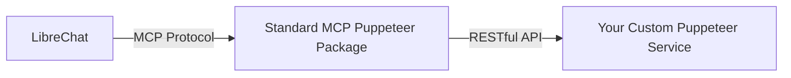
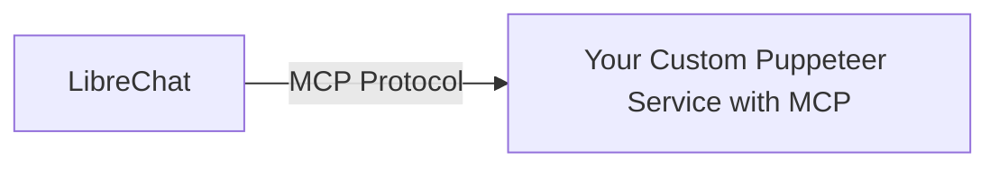

# Puppeteer MCP Integration Options for LibreChat

Based on our discussion, there are two main approaches to integrate your Puppeteer service with LibreChat's MCP system:

## Option 1: Use Standard MCP Package as an Adapter



### How It Would Work

1. LibreChat connects to the standard `@modelcontextprotocol/server-puppeteer` package via MCP
2. The MCP Puppeteer package would need to be configured to connect to your custom Puppeteer service
3. Your custom service would remain a RESTful API service

### Configuration Example

```yaml
# LibreChat's librechat.yaml
mcpServers:
  puppeteer:
    type: stdio
    command: npx
    args:
      - -y
      - "@modelcontextprotocol/server-puppeteer"
      # You might need additional arguments to point to your service
      - --service-url=http://puppeteer-service:3000
    timeout: 300000
```

### Pros and Cons

**Pros:**
- Minimal changes to your existing service
- Leverages the standard MCP implementation
- LibreChat is already designed to work with this package

**Cons:**
- Adds an extra layer in the architecture
- May not support all your custom functionality
- Requires the standard MCP package to support external service connections
- Additional network configuration complexity

## Option 2: Adapt Your Service to Implement MCP Directly



### How It Would Work

1. Modify your Puppeteer service to implement the MCP protocol
2. LibreChat would connect directly to your service via MCP
3. No intermediate adapter needed

### Implementation Steps

1. Add MCP protocol dependencies to your project
2. Implement the MCP server interface
3. Convert your RESTful endpoints to MCP tools and resources
4. Configure LibreChat to connect to your service

### Configuration Example

```yaml
# LibreChat's librechat.yaml
mcpServers:
  puppeteer-service:
    type: stdio  # or potentially "http" if you implement that transport
    command: docker
    args:
      - exec
      - -i
      - puppeteer-service
      - node
      - /app/dist/index.js
    timeout: 300000
```

### Pros and Cons

**Pros:**
- Direct integration without middleware
- Full control over the implementation
- Can expose all your custom functionality
- Cleaner architecture

**Cons:**
- More development work required
- Need to learn and implement the MCP protocol
- Would need to maintain compatibility with MCP specifications

## Recommendation

**Option 2 (Adapting your service to implement MCP directly) is recommended for the long term** because:

1. It provides a cleaner architecture without middleware
2. Gives you full control over the functionality exposed
3. Eliminates potential compatibility issues with the standard package
4. Results in a more maintainable solution

While it requires more upfront work to implement the MCP protocol, it will likely be more robust and flexible in the long run.

## Implementation Resource

The MCP protocol specification and examples can be found here:
- [MCP SDK Documentation](https://github.com/model-context-protocol/sdk)
- [MCP Server Examples](https://github.com/model-context-protocol/servers)

## Next Steps

1. Decide which option best fits your timeline and resources
2. If Option 1: Explore if the standard MCP Puppeteer package can be configured to connect to external services
3. If Option 2: Begin adapting your service to implement the MCP protocol

Would you like a more detailed implementation plan for either approach?