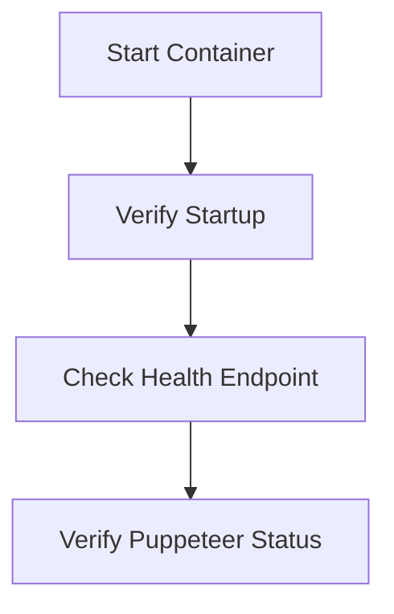
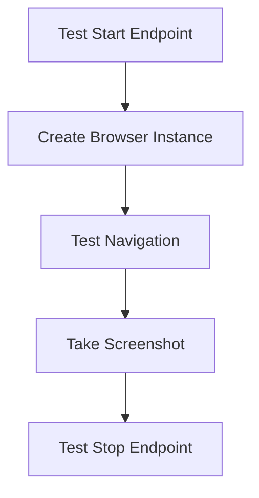
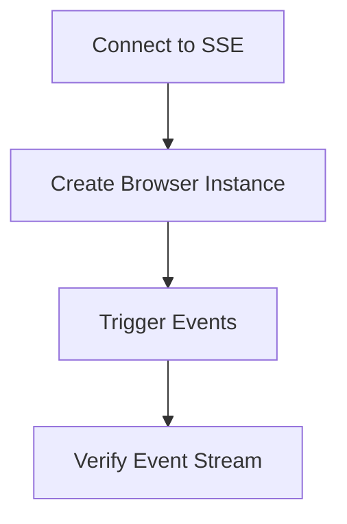
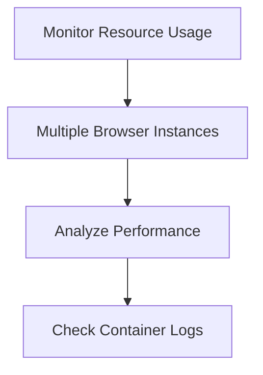

# Puppeteer Service Testing Plan

## Overview

This document outlines our approach for testing the Puppeteer Service Docker container and its API functionality. The goal is to verify that the service works correctly in a containerized environment and that Puppeteer can successfully control Chromium within Docker.

## Testing Phases

### Phase 1: Container Startup and Health Check



#### Commands:

1. **Start the container:**
   ```bash
   docker-compose up
   ```

2. **Verify the container is running:**
   ```bash
   docker ps
   ```

3. **Check the health endpoint:**
   ```bash
   curl http://localhost:3000/health
   ```

### Phase 2: API Functionality Testing



#### Commands:

1. **Create a browser instance:**
   ```bash
   curl -X POST http://localhost:3000/puppeteer-service/start -H "Content-Type: application/json"
   ```
   Expected response: JSON with browser instance ID

2. **Create a page and navigate to a URL (using the browser ID from previous step):**
   ```bash
   curl -X POST http://localhost:3000/puppeteer-service/test \
        -H "Content-Type: application/json" \
        -d '{"browserId": "<BROWSER_ID>", "url": "https://example.com"}'
   ```
   Expected response: JSON with success status and screenshot data (base64 encoded)

3. **Stop the browser instance:**
   ```bash
   curl -X POST http://localhost:3000/puppeteer-service/stop \
        -H "Content-Type: application/json" \
        -d '{"browserId": "<BROWSER_ID>"}'
   ```
   Expected response: JSON with success status

### Phase 3: SSE Connection Testing



#### Commands:

1. **Connect to the SSE endpoint (in a separate terminal):**
   ```bash
   curl -N http://localhost:3000/puppeteer-service/events
   ```

2. **Create a browser instance and navigate to generate events:**
   ```bash
   # Create browser instance
   curl -X POST http://localhost:3000/puppeteer-service/start -H "Content-Type: application/json"
   
   # Use test endpoint to generate navigation events
   curl -X POST http://localhost:3000/puppeteer-service/test \
        -H "Content-Type: application/json" \
        -d '{"browserId": "<BROWSER_ID>", "url": "https://example.com"}'
   ```

3. **Observe the events in the SSE terminal**

### Phase 4: Performance and Resource Usage



#### Commands:

1. **Monitor container resource usage:**
   ```bash
   docker stats puppeteer-service
   ```

2. **Check container logs:**
   ```bash
   docker logs puppeteer-service
   ```

3. **Create multiple browser instances to test performance:**
   ```bash
   # Run this command multiple times
   curl -X POST http://localhost:3000/puppeteer-service/start -H "Content-Type: application/json"
   ```

## Success Criteria

1. **Container Health:**
   - Container starts without errors
   - Health endpoint returns status 200
   - Puppeteer status shows as "READY"

2. **Puppeteer Functionality:**
   - Browser instances can be created
   - Pages can be created and navigated
   - Screenshots can be taken
   - Browser instances can be closed

3. **SSE Functionality:**
   - Events are generated and received
   - Event format is correct
   - Connection remains stable

4. **Performance:**
   - Container resource usage is within expected limits
   - Multiple browser instances can run concurrently
   - No memory leaks observed during extended operation

## Test Results Documentation

Test results should be documented in a separate file (`testResults.md`) with the following structure:

1. Test date and environment
2. Commands executed and their responses
3. Observations regarding performance and stability
4. Issues encountered and their resolution
5. Recommendations for improvement

## Next Steps After Testing

1. Address any issues discovered during testing
2. Optimize container configuration based on performance observations
3. Implement additional features or endpoints as needed
4. Document final configuration and usage instructions in README.md